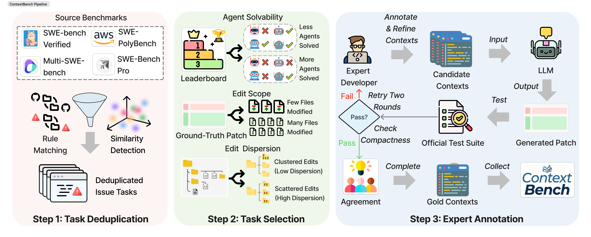
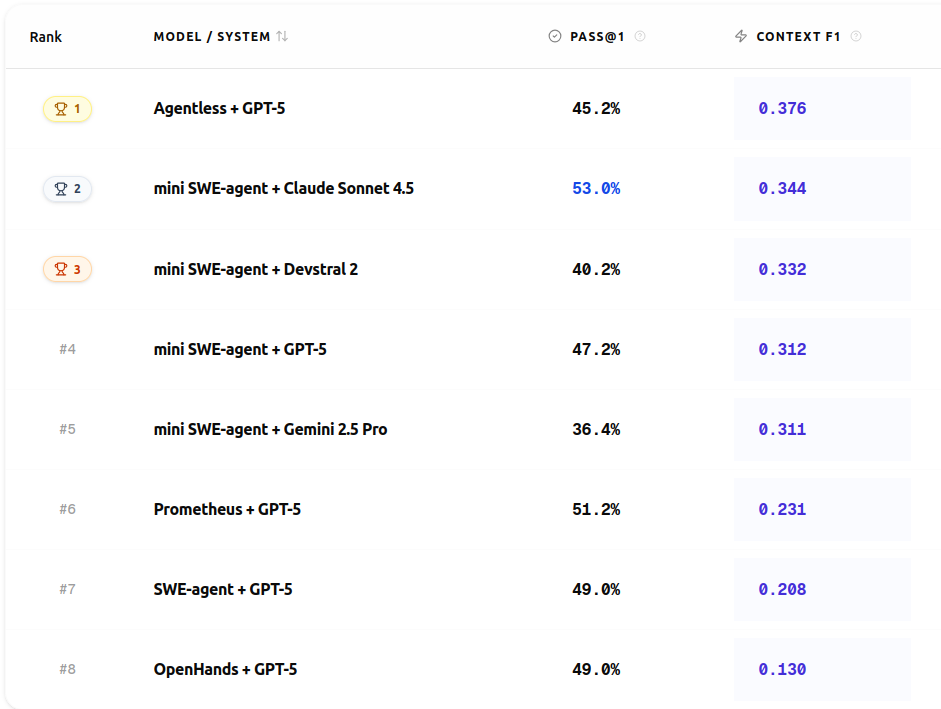

<p align="center">
  
</p>

<h1 align="center">ContextBench</h1>

<p align="center">
  <strong>A Comprehensive Benchmark for Evaluating Context Retrieval in Code Agents</strong>
</p>


<p align="center">
  <a href="https://arxiv.org/abs/2602.05892"></a>
  <a href="https://huggingface.co/datasets/Contextbench/ContextBench"></a>
  <a href="https://contextbench.github.io/"></a>
  <a href="docs/"></a>
  <a href="LICENSE"></a>
</p>

<p align="center">
  <em>A collaboration between</em><br>
  
  &nbsp;&nbsp;&nbsp;&nbsp;
  
</p>

---

## Overview 

LLM-based coding agents have shown strong performance on automated issue resolution benchmarks, yet existing evaluations largely focus on final task success, providing limited insight into how agents retrieve and use code context during problem solving.

We introduce **ContextBench**, a process-oriented evaluation of context retrieval in coding agents. ContextBench consists of **1,136** issue-resolution tasks from 66 repositories across eight programming languages, each augmented with human-annotated gold contexts. We further implement an automated evaluation framework that tracks agent trajectories and measures context recall, precision, and efficiency throughout issue resolution.

Using ContextBench, we evaluate four frontier LLMs and five coding agents. Our results show that sophisticated agent scaffolding yields only marginal gains in context retrieval (**"The Bitter Lesson"** of coding agents), LLMs consistently favor recall over precision, and substantial gaps exist between explored and utilized context.

ContextBench augments existing end-to-end benchmarks with intermediate gold-context metrics that unbox the issue-resolution process. These contexts offer valuable intermediate signals for guiding LLM reasoning in software tasks.


<p align="center">
  
</p>


The pipeline extracts file views and spans from agent trajectories, then computes coverage and precision metrics by comparing against human-annotated gold context at multiple granularities.

## Leaderboard

<p align="center">
  
</p>

🏆 **Live leaderboard and interactive results**: [https://contextbench.github.io/](https://contextbench.github.io/)

## Quickstart

### Installation

```bash
# Install dependencies
pip install -r requirements.txt
```

### Download Dataset

Download the ContextBench dataset from Hugging Face:

```python
from datasets import load_dataset

# Load full dataset (1,136 instances)
dataset = load_dataset("Contextbench/ContextBench", "default")

# Or load the verified subset (500 instances)
dataset_verified = load_dataset("Contextbench/ContextBench", "contextbench_verified")

# Save to parquet for evaluation
dataset['train'].to_parquet("data/full.parquet")
```

Or download directly from: [🤗 Hugging Face Dataset](https://huggingface.co/datasets/Contextbench/ContextBench)

### Run Evaluation

```bash
python -m contextbench.evaluate \
    --gold data/full.parquet \
    --pred path/to/trajectory.traj.json \
    --out results.jsonl
```

The evaluation automatically detects trajectory formats, clones repositories, extracts code symbols, and computes comprehensive metrics across file, symbol, span, and edit-location granularities.


## Documentation

 **Complete documentation** is available in the [`docs/`](docs/) directory:

- [**Agent Trajectory Extractors**](docs/agents.md) – How to extract trajectories from different agents (Agentless, SWE-agent, MiniSWE, etc.)
- [**Running Agents on ContextBench**](docs/run_agent_on_contextbench.md) – Unified runner (`python -m contextbench.run`) for evaluating agents across all benchmark variants
- [**Process Trajectories**](docs/process_trajectories.md) – Details on trajectory format and parsing

## Repository Layout

```
ContextBench/                    # Repository root
├── README.md                    # This file (project homepage)
├── contextbench/                # Python package
│   ├── agents/                  # Trajectory extractors for different agents
│   ├── core/                    # Repo management, intervals, file I/O
│   ├── extractors/              # Tree-sitter symbol extraction
│   ├── metrics/                 # Metric computation
│   ├── parsers/                 # Gold, trajectory, and diff parsers
│   └── evaluate.py              # Main evaluation entrypoint
├── data/                        # Benchmark datasets (Verified, Pro, Poly, Multi)
│   ├── selected_500_instances.csv
│   └── *.parquet
├── docs/                        # Documentation and assets
│   ├── source/                  # Sphinx RST documentation
│   └── assets/                  # Images and figures
├── scripts/                     # Utility scripts for running agents
├── agent-frameworks/            # Agent implementation submodules
│   ├── agentless/
│   ├── mini-swe-agent/
│   ├── openhands/
│   └── swe-agent/
└── requirements.txt             # Python dependencies
```

For detailed metrics definitions and implementation, see the [Sphinx documentation](docs/).

## Citation

If you use ContextBench in your research, please cite our paper:

```bibtex
@misc{li2026contextbenchbenchmarkcontextretrieval,
  title={ContextBench: A Benchmark for Context Retrieval in Coding Agents}, 
  author={Han Li and Letian Zhu and Bohan Zhang and Rili Feng and Jiaming Wang and Yue Pan and Earl T. Barr and Sarro Federica and Zhaoyang Chu and He Ye},
  year={2026},
  eprint={2602.05892},
  archivePrefix={arXiv},
  primaryClass={cs.LG},
  url={https://arxiv.org/abs/2602.05892}
}
```

📄 **Paper**: [arXiv:2602.05892](https://arxiv.org/abs/2602.05892)

## Acknowledgements

ContextBench is a collaborative research project between:

- **Nanjing University** (南京大学)
- **University College London**

We thank the developers of the agent frameworks evaluated in this benchmark: Agentless, SWE-agent, Mini-SWE-Agent, OpenHands, and Prometheus.

We gratefully acknowledge **Mistral AI** and **Amazon Web Services (AWS)** for providing API support that enabled large-scale experiments and evaluations.

## License

This project is licensed under the **Apache License 2.0**. See the [LICENSE](LICENSE) file for details.

---

